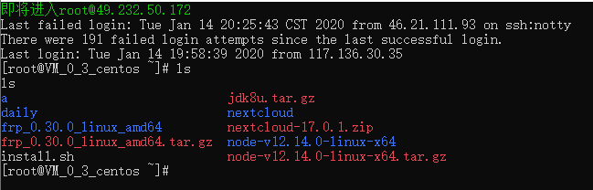

# 概述

qc（Server `Q`uick `C`onnect Helper）是一款在终端下运行的服务器群组ssh连接工具

> 主界面

> 连接远程ssh终端

> 增加记录

> 删除记录

# 依赖

- 基础环境：python 3

- 第三方库：paramiko

    `pip install paramiko -i https://pypi.tuna.tsinghua.edu.cn/simple --user`

# 运行

> 支持Linux、Windows7、Windows10

## Linux

- `./qc` 进入主界面 

- `./qc tag` 直连

## Windows

- `.\qc.bat` 进入主界面

